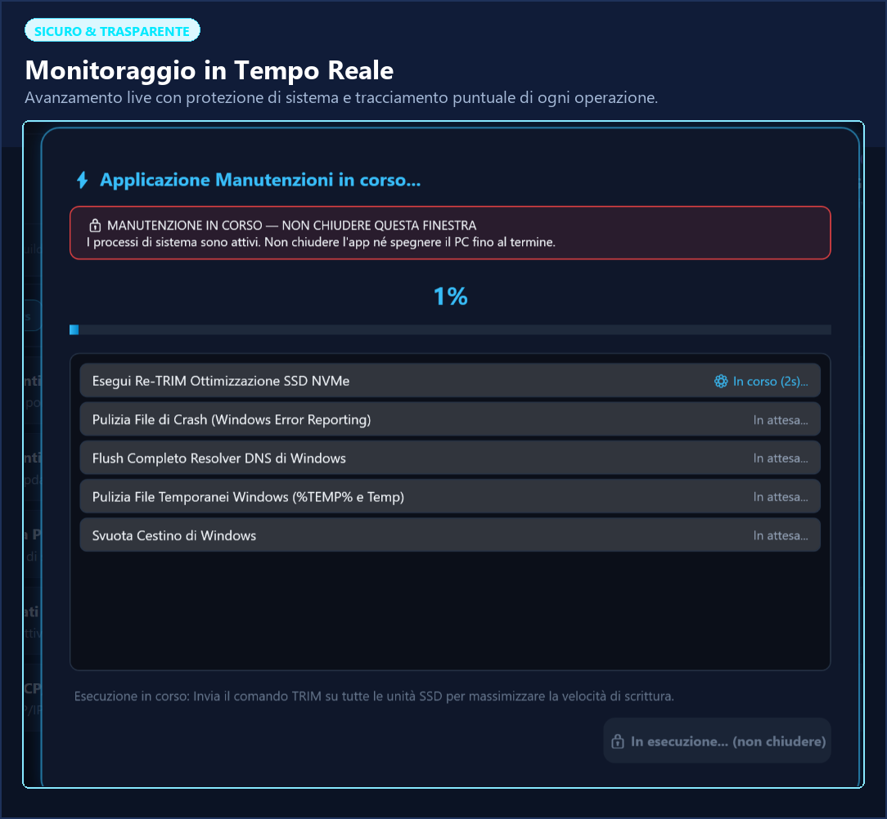

# 🚀 Universal System & Windows Maintenance Center

[](https://github.com/Kabuby79/SystemOptimizer)
[](https://github.com/Kabuby79/SystemOptimizer)
[](LICENSE)
[](https://dotnet.microsoft.com)
[](https://ko-fi.com/kabuby)

<p align="center">
  <a href="https://github.com/Kabuby79/SystemOptimizer/releases/latest/download/SystemOptimizer.exe">
    
  </a>
  &nbsp;&nbsp;
  <a href="https://ko-fi.com/kabuby">
    
  </a>
</p>

**Universal System & Windows Maintenance Center** è una suite di manutenzione desktop standalone ad alte prestazioni per Windows 10 e Windows 11. Progettata con un'interfaccia moderna in stile **Dark Glassmorphism**, riunisce strumenti avanzati di diagnostica hardware, riparazione dell'integrità di sistema, risparmio energetico e pulizia profonda in un **unico file eseguibile portabile**.

---

## 📸 Anteprima & Screenshot

<p align="center">
  
</p>

<p align="center">
  
</p>

---

## 🌟 Caratteristiche Principali

### ⚡ Profili di Manutenzione Rapidi
* 🛡️ **Manutenzione Basic**: Esegue compiti di manutenzione ordinaria leggeri e veloci (pulizia cache DNS, file temporanei sicuri, svuotamento cestino, TRIM SSD).
* ⭐ **Seleziona Consigliati**: Il profilo di riferimento ideale per mantenere il PC reattivo e protetto senza alcun rischio.
* 🚀 **Manutenzione Totale**: Esegue una manutenzione profonda e completa dell'intero sistema operativo per utenti esperti.
* ✍️ **Selezione Manuale**: Permette di personalizzare liberamente ogni singolo compito con un clic.

### 🔍 Ricerca Istantanea in Tempo Reale
* Campo di ricerca dinamico integrato per trovare al volo qualsiasi funzione o strumento per parola chiave (es. *sfc*, *dism*, *batteria*, *driver*, *cache*, *telemetria*).

### 📊 Diagnostica Hardware & S.M.A.R.T.
* **Monitoraggio in Tempo Reale**: Carico e specifiche di CPU, Memoria RAM (libera/in uso), GPU e versione dei driver grafici.
* **Stato di Salute Dischi & S.M.A.R.T.**: Rilevamento di tutti i dischi fisici interni ed esterni con verifica preventiva dei sensori di guasto hardware.
* **Analisi File System**: Controllo compatibilità blocchi in scrittura, Defrag e CHKDSK per ogni partizione.

### 🛡️ Riparazione Avanzata del Sistema Operativo
* **Integrità File di Sistema (SFC)**: Scansione e ripristino automatico dei file Windows corrotti.
* **Riparazione Immagine Windows (DISM)**: Ripristino dello stato di salute dell'archivio componenti (`RestoreHealth`).
* **Pulizia Profonda WinSxS**: Rimozione sicura dei vecchi pacchetti di aggiornamento obsoleti per liberare giga di spazio.
* **Rete e Risparmio Energia**: Reset stack TCP/IP, Flush DNS e attivazione dei profili energetici ottimizzati.

### 📄 Report Completo Hardware & Software (.txt)
* Esportazione con un clic di un report dettagliato contenente tutte le specifiche hardware, le partizioni, lo stato dei servizi critici, l'avvio automatico e la **diagnostica degli errori/crash di Windows (BSOD, Kernel-Power 41, Application Hang/Error)** degli ultimi 14 giorni.

---

## 📥 Download Diretto & Avvio

1. Clicca sul pulsante verde in alto **"SCARICA PER WINDOWS"** per scaricare direttamente **`SystemOptimizer.exe`**.
2. Fai doppio clic su `SystemOptimizer.exe`.
3. Il programma richiederà automaticamente i privilegi di Amministratore (UAC) necessari per eseguire le manutenzioni di sistema.

> ℹ️ **Nota Windows SmartScreen**:
> Trattandosi di un'applicazione open-source gratuita distribuita senza certificato a pagamento per la firma digitale, al primo avvio Windows Defender SmartScreen potrebbe mostrare un avviso blu (*"PC protetto da Windows"*). È sufficiente cliccare su **"Ulteriori informazioni"** ➔ **"Esegui comunque"**.

---

## 🛠️ Compilazione da Sorgente

Il progetto non richiede l'installazione di pesanti IDE esterni: può essere compilato direttamente tramite lo script PowerShell incluso utilizzando il compilatore nativo Windows:

```powershell
# Esegui lo script di compilazione nativo
.\build_app.ps1
```

---

## ⚖️ Note Legali & Disclaimer (Esclusione di Responsabilità)

* **Licenza & Uso**: Questo software viene distribuito gratuitamente e fornito *"così com'è"* (**AS IS**), senza garanzie di alcun tipo, esplicite o implicite. L'utente utilizza l'applicazione a proprio rischio e discrezione.
* **Responsabilità**: Lo sviluppatore non potrà in alcun caso essere ritenuto responsabile per danni diretti o indiretti, perdite di dati o instabilità di sistema derivanti dall'utilizzo o dall'errata esecuzione delle funzioni avanzate.
* **Marchi Registrati**: *Windows 10, Windows 11, DISM, SFC, CHKDSK e Microsoft sono marchi registrati di Microsoft Corporation. Questo progetto è indipendente e non è affiliato, autorizzato né sponsorizzato da Microsoft.*

---

## ☕ Supporta lo Sviluppo

Se questo software ti è stato utile per velocizzare, ottimizzare e mantenere in salute il tuo PC, puoi supportare lo sviluppo continuo e i futuri aggiornamenti con una donazione libera:

[](https://ko-fi.com/kabuby)

---
*Progettato per garantire la massima efficienza e velocità su Windows.*
